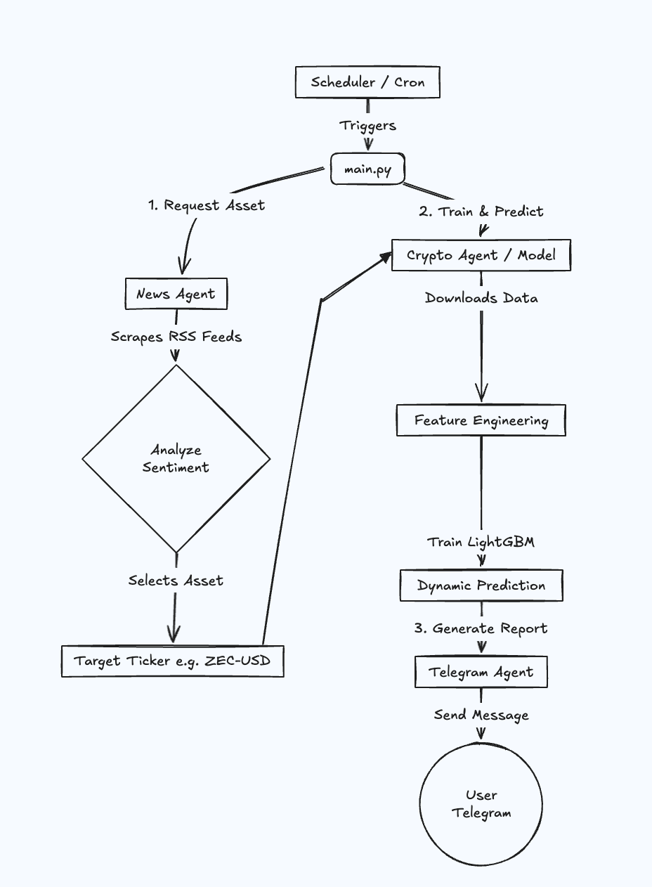

# 🚀 Crypto Agent: AI-Powered Crypto Intelligence


**Crypto Agent** is an advanced multi-agent system designed to automate cryptocurrency market analysis. By combining real-time news scraping with machine learning-based price forecasting, it delivers actionable insights directly to your Telegram.

---

## ✨ Features

*   **📰 Real-Time News Intelligence**: Automatically scrapes and summarizes the latest crypto news using `DuckDuckGo` search.
*   **🧠 ML-Powered Forecasting**: Utilizes a **LightGBM** model trained on historical price data and technical indicators (RSI, MACD, Bollinger Bands, etc.) to predict daily price movements.
*   **🤖 Multi-Agent Architecture**: Built on the **Agno** framework, orchestrating specialized agents for news, analysis, and communication.
*   **📱 Instant Alerts**: Delivers formatted daily reports to your Telegram chat.
*   **🐳 Dockerized**: Fully containerized for easy deployment and automated scheduling.

---

## 🔄 Agent Pipeline

The system operates on a scheduled pipeline orchestrated by `main.py`:



1.  **News Agent**: Scans RSS feeds (CoinDesk, Cointelegraph, etc.) to find the most significant market-moving news. It selects a target asset (Bullish or Bearish).
2.  **Crypto Agent**: Dynamically downloads historical data for that asset, calculates technical features, calculates volatility-based thresholds, and trains a LightGBM model to predict the next day's return.
3.  **Telegram Agent**: Formats the prediction, news context, and trade setup (Entry, SL, TP) into a readable message and sends it to your Telegram.

---

## 🛠️ Prerequisites

*   **Python 3.10+**
*   **Docker** & **Docker Compose** (Recommended)
*   **API Keys**:
    *   `GOOGLE_API_KEY`: For the Agno agents (Gemini Flash).
    *   `TELEGRAM_TOKEN` & `TELEGRAM_CHAT_ID`: For receiving alerts.

---

## 🚀 Setup Guide

### Option A: Docker (Recommended)

1.  **Clone the Repository**
    ```bash
    git clone https://github.com/sakspari/CryptoAgent.git
    cd CryptoAgent
    ```

2.  **Configure Environment**
    ```bash
    cp .env.example .env
    ```
    Edit `.env` and fill in your keys:
    ```ini
    GOOGLE_API_KEY=your_google_api_key
    TELEGRAM_TOKEN=your_telegram_bot_token
    TELEGRAM_CHAT_ID=your_chat_id
    ```

3.  **Run with Docker Compose**
    This will build the image and start the scheduler (runs at 07:00 and 14:00).
    ```bash
    docker-compose up -d --build
    ```

4.  **Check Logs**
    ```bash
    docker-compose logs -f
    ```

### Option B: Local Development

1.  **Install Dependencies**
    Using `uv` (recommended) or `pip`:
    ```bash
    pip install -r requirements.txt
    # OR
    uv pip install -r pyproject.toml
    ```

2.  **Train Model (Initial)**
    Although the system trains dynamically, you can verify the training pipeline:
    ```bash
    python src/train_model.py
    ```

3.  **Run Manually**
    To trigger a one-off run immediately:
    ```bash
    python -m src.main
    ```

---

## ☁️ Deployment Guide

To deploy this on a VPS (e.g., DigitalOcean, AWS EC2, Hetzner):

1.  **Provision a Server**: Ubuntu 22.04 LTS is recommended.
2.  **Install Docker**:
    ```bash
    curl -fsSL https://get.docker.com -o get-docker.sh
    sh get-docker.sh
    ```
3.  **Deploy**:
    ```bash
    # On your local machine, copy files to server
    scp -r crypto-agent user@your-server-ip:~/

    # SSH into server
    ssh user@your-server-ip
    cd crypto-agent

    # Setup Env
    cp .env.example .env
    nano .env # Add your keys

    # Start
    docker compose up -d --build
    ```
4.  **Maintenance**:
    The container handles scheduling internally. If it crashes, Docker will restart it (ensure `restart: always` is in `docker-compose.yml`).

---

## 📂 Project Structure

```
.
├── artifacts/          # Trained models and feature metadata
├── data/               # Raw downloaded market data
├── src/
│   ├── agents/         # Agno agent definitions (News, Telegram)
│   ├── utils/          # Data loading, feature engineering, model training
│   ├── main.py         # Main orchestration script
│   └── train_model.py  # Model training logic
├── Dockerfile          # Docker image definition
├── docker-compose.yml  # Container orchestration
└── requirements.txt    # Python dependencies
```

---

## ⚠️ Disclaimer

**This software is for educational and research purposes only.** The predictions generated by the model are probabilistic and do not constitute financial advice. Cryptocurrency trading involves significant risk.

---

Made with ❤️ using [Agno](https://docs.agno.com).
